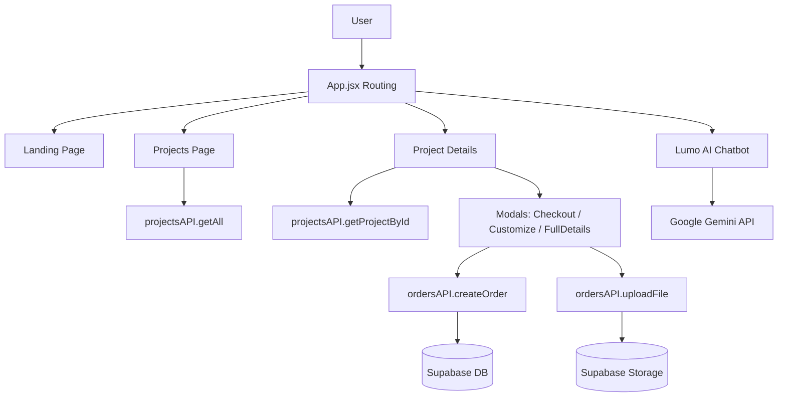

# RNS ProjectKart - Technical Documentation

## 1. Project Overview
RNS ProjectKart is a specialized e-commerce and portfolio platform designed for students and hobbyists to discover, customize, and purchase engineering projects (Hardware, Software, IoT, Embedded Systems, etc.). The application features a modern, responsive UI with advanced filtering, 3D-style interactions, and an AI-powered assistant.

## 2. Technology Stack

### Frontend
- **Framework**: React 18 (Vite)
- **Routing**: React Router DOM v6+
- **Styling**: Tailwind CSS, Shadcn UI (components), Framer Motion (animations)
- **Icons**: Lucide React, Tabler Icons

### Backend / Services
- **Database**: Supabase (PostgreSQL)
- **Authentication**: Supabase Auth (Context provider setup in `AuthContext`)
- **Storage**: Supabase Storage (Buckets: `customer-files` for synopsis uploads)
- **Edge Functions**: Supabase Edge Functions (e.g., `send-order-email`)
- **AI Integration**: Google Gemini API (`gemini-pro`) for the "Lumo" chatbot

## 3. Architecture & Directory Structure



### Key Directories
- `/src/components`: Reusable UI components and Modals.
- `/src/pages`: Main view controllers (`ProjectsPage.jsx`).
- `/src/lib`: Configuration clients (`supabase.js`, `gemini.js`).
- `/src/utils`: Helper functions and API wrappers (`api.js`, `projectTransform.js`).
- `/supabase`: Database migrations and schema definitions.

## 4. Key Functional Modules

### A. Projects Management (`ProjectsPage.jsx`)
- **Display**: Grid view of projects with category badges and price.
- **Filtering**:
  - **Category Tabs**: Filters by predefined categories (Hardware, IoT, AI, etc.).
  - **Search**: Real-time search by title, description, or category using `PlaceholdersAndVanishInput`.
- **Logic**: Fetches all projects via `projectsAPI.getAll()` and applies client-side filtering. Transform logic ensures consistent data structure even if DB fields are missing.

### B. Project Details (`ProjectDetails.jsx`)
- **Dynamic Routing**: `/project/:id` loads specific project data.
- **Features**:
  - **Gallery**: Interactive image collage with "View in 3D" badges.
  - **Visual Specs**: Priority rating, price, and "Watch Demo" integration.
  - **Contextual Actions**: Direct "Buy Now" or "Customize" options.
- **Detailed View**: Opens `ProjectFullDetailsModal` for an in-depth blueprint view (Timeline, Tech Specs, Block Diagrams, Components).

### C. Order System
Two primary flows for purchasing:

1.  **Direct Checkout (`CheckoutModal.jsx`)**
    - **Trigger**: "Buy Now" button.
    - **Input**: User details (Name, Email, Phone, College).
    - **Process**: Creates a `pending` order in the `orders` table linked to the project.

2.  **Customization Request (`CustomizationModal.jsx`)**
    - **Trigger**: "Customize" button.
    - **Multi-step Wizard**:
        1.  **Basic Details**: Custom title, abstract, deadline.
        2.  **Technical Specs**: Requirements, features, and PDF Synopsis upload.
        3.  **Personal Info**: Contact details.
    - **Process**: Uploads PDF to Supabase Storage -> Relays URL -> Creates an order with `is_custom: true`.

### D. AI Assistant - "Lumo" (`Chatbot.jsx`)
- **Engine**: Google Gemini Pro (`gemini-pro`).
- **Function**: Floating widget available globally.
- **Capabilities**: answers questions about projects, provides technical guidance, and assists with site navigation.
- **Session Management**: Maintains chat history within the component lifecycle to prevent context loss.

## 5. Database Schema (Inferred)

### `projects` Table
- `id` (UUID): Primary Key
- `title`, `description`: Text
- `price` (Number/JSONB): Base cost
- `category`: Project type
- `image_url`: Main display image
- `tech_specs` (JSONB): Key-value pairs for technical details
- `features` (Array): List of highlight features

### `orders` Table
- `id` (UUID): Primary Key
- `project_id`: Foreign Key to projects
- `customer_name`, `user_email`, `phone_number`: Contact info
- `status`: Order status (e.g., 'pending', 'customization_requested')
- `is_custom`: Boolean flag
- `custom_requirements`: Text for customization requests

## 6. Environment Variables
Required `.env` setup:
```env
VITE_SUPABASE_URL=your_project_url
VITE_SUPABASE_ANON_KEY=your_anon_key
# API Key for Gemini is currently hardcoded in src/lib/gemini.js due to environment constraints, 
# but should be VITE_GEMINI_API_KEY in production.
```
